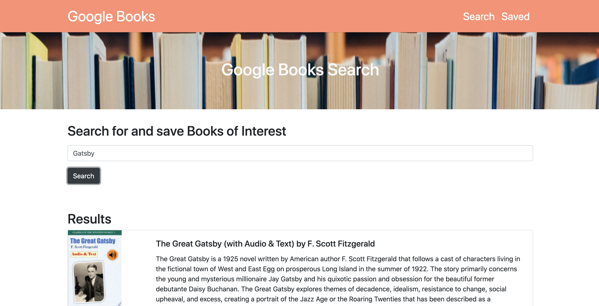

# Google Books Search 
This is a full MERN Stack application where a user can go in and search a book that they like and save their books.

[](https://opensource.org/licenses/MIT)
## Table of Contents
* [Description](#description)
* [URL](#url)
* [Installation](#installation)
* [License](#license)
* [Links](#Links)
* [Usage](#Usage)
* [Questions](#questions)
## Description 
React-based Google Books Search app that allows users to search and save books.

## Installation
1. Download or clone repository
2. ```npm install``` to install the required npm packages to run
## Usage
* Application will be invoked by using the following command:
```npm start```
* Open your browser and go to
```http://localhost:3000```
* Home page displays the search bar
* Saved page will show your saved books
## Links
* [GitHub!](https://github.com/lindseybowen/Google-Books-Search)
* [Heroku Deployed App!](https://ancient-sands-17398.herokuapp.com/)
## Questions
Please contact me below with any questions you have about the application.
* Github: https://github.com/lindseybowen
* Email: lindseyjbowen@gmail.com 
